# Spring Security OAuth2 Demo Applications for Okta

This repository contains demo applications that demonstrates how to integrate the following OAuth 2.0 flows into your [Spring Boot](https://projects.spring.io/spring-boot/) Application:

- [Authorization Code](https://developer.okta.com/docs/guides/implement-auth-code/overview/) Flow
- [Client Credentials](https://developer.okta.com/docs/guides/implement-client-creds/overview/) Flow

SPA Demo to show [Authorization Code Flow with PKCE](https://developer.okta.com/docs/guides/implement-auth-code-pkce/overview/) can be found [here](https://github.com/gennadyyonov/hello-okta-spa)

## Required Software

### Java

- JDK 15

### Lombok

#### IntelliJ 

- Download and install Lombok [plugin](https://plugins.jetbrains.com/plugin/6317-lombok-plugin)
- Enable Annotation Processors
  -  Go to **Setting > Build, Execution, Deployment > Compiler > Annotation Processors**
  -  Check _Enable annotation processing_
  
### Build/Deployment Automation Software

[Gradle](https://gradle.org/) is used as a build automation tool. 
Several major IDEs allow you to import Gradle builds and interact with them.
IntelliJ IDEA supports a fully-functional integration with Gradle.

[Docker](https://www.docker.com/) is a software platform that allows us to build, test, and deploy applications quickly. 

## Build Project

`$ gradlew clean build`

## Modules

This project contains several modules, here are the main ones you to focus on and run:

| MODULE | DESCRIPTION |
| --- | --- |
| [hello-okta-api](hello-okta-api/README.md) | REST API Backend Server.<br> Exposes domain API over REST.<br>Secured by Okta. |
| [hello-okta-bff](hello-okta-bff/README.md) | BFF (Backend for Frontend) Server.<br>Aggregates data from downstream services (for example [hello-okta-api](hello-okta-api/README.md)) providing API tailored to Front-end (SPA) needs.<br>Secured by Okta.|
| [hello-okta-api-client](hello-okta-api-client/README.md) | [REST API Server](hello-okta-api/README.md) Client. |

Other modules contains shared source code.

## Run Modules

There are 2 runnable modules in this project:

- [hello-okta-api](hello-okta-api/README.md)
- [hello-okta-bff](hello-okta-bff/README.md)

Each of them contains instructions how to **Run Application on localhost** in `README.md` file.

**Note**, both of them should be up and running to see the demo.

## Tech Stack
- [Spring Boot](https://projects.spring.io/spring-boot/) : Application framework
- [Spring Cloud Sleuth](https://github.com/spring-cloud/spring-cloud-sleuth) : Distributed tracing tool for Spring Cloud
- [Lombok](https://projectlombok.org/features/index.html) : Utility library for Java language
- [GraphQL](http://graphql.org/learn/) : API query runtime
  - [GraphQL and GraphiQL Spring Framework Boot Starters](https://github.com/graphql-java-kickstart/graphql-spring-boot)
  - [GraphQL Java Tools](https://github.com/graphql-java-kickstart/graphql-java-tools)
- [Feign](https://github.com/OpenFeign/feign) : Declarative REST Client
- [WireMock](https://github.com/tomakehurst/wiremock) : Simulator for HTTP-based APIs
- [Springdoc OpenAPI 3.0](https://github.com/springdoc/springdoc-openapi) : Spring Boot RESTful API Documentation
- [Checkstyle](https://checkstyle.sourceforge.io/index.html)
- [Helm](https://helm.sh) : Package manager for Kubernetes

## Okta Configuration

Head on over to [developer.okta.com](https://developer.okta.com/signup/) to create a free-forever developer account. 
Look for the email to complete the initialization of your Okta org. 

### Set Up OpenID Connect Application

Login to your Okta account.
Navigate to **Applications** in the admin console and click: **Add Application**. 
Choose _Native_ and click **Next**.

Populate the fields with these values:

| FIELD NAME | VALUE |
| --- | ---|
| **Name** | `Hello Okta App` |
| **Login redirect URIs**  | http://localhost:8060/login/oauth2/code/okta<br>http://localhost:8070/login/oauth2/code/okta<br>http://localhost:3000/implicit/callback<br>https://kubernetes.docker.internal/api/login/oauth2/code/okta<br>https://kubernetes.docker.internal/bff/login/oauth2/code/okta<br>https://kubernetes.docker.internal/implicit/callback |
| **Logout redirect URIs** | http://localhost:3000<br>https://kubernetes.docker.internal |
| **Allowed grant types**  | `Authorization Code` |

Click **Done**.

**General Settings** tab will be displayed:

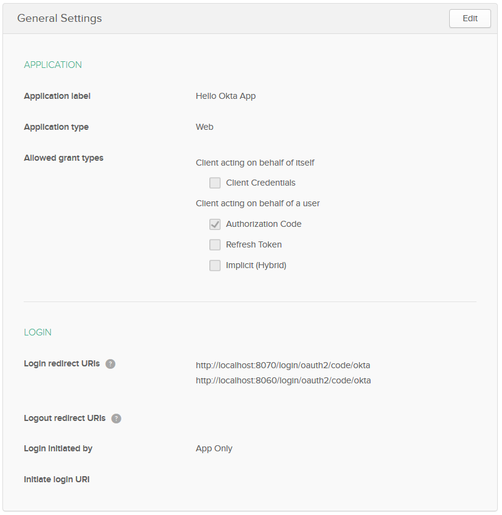

Scroll down to the **Client Credentials** section and copy the `Client ID`. This value will be used by our app.

Make sure that:
* **Initiate login URI** is empty
* **Use PKCE (for public clients)** radio button is selected as **Client authentication** in **Client Credentials** section.

### Set Up Client Application

This Application will be used for Server-to-Server Communication between Client and Server application back-ends using [Client Credentials](https://developer.okta.com/docs/guides/implement-client-creds/overview/) authorization flow.

Navigate to **Applications** in the admin console and click: **Add Application**. 
Choose _Service_ and click **Next**.

Populate the fields with these values:

| FIELD NAME | VALUE |
| --- | ---|
| **Name** | `Hello Okta App Client` |

Click **Done**.

**General Settings** tab will be displayed:

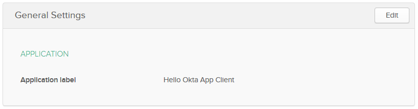

Scroll down to the **Client Credentials** section and copy the `Client ID` and `Client Secret`. These values will be used by our app.

### Set Up Authorization Server

Navigate to **API > Authorization Servers**. Click **Add Authorization Server**. 
Fill in the values:

| FIELD NAME | VALUE |
| --- | ---|
| **Name** | `Hello Okta App` |
| **Description** | `Hello Okta App` |
| **Audience** | `api://hellookta` |

Click **Done**.

**Settings** tab will be displayed:

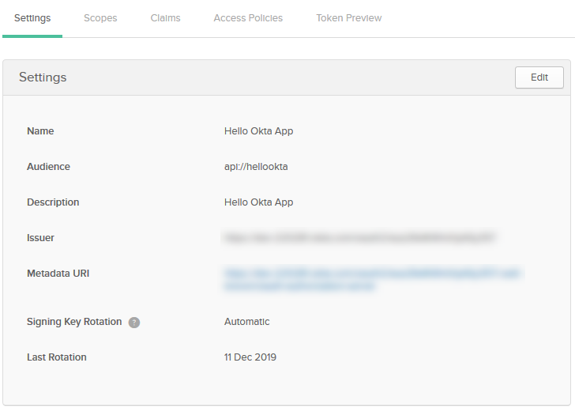

Copy the `Issuer` URL. This value will be used by our app.

#### Scopes

Create a [custom scope](https://www.oauth.com/oauth2-servers/scope/defining-scopes/) for our consumer application to restrict access token to this example.

From the menu bar select **API > Authorization Servers**. 
Edit the authorization server created in the previous step by clicking on the edit pencil, then click **Scopes > Add Scope**. 
Fill out the name field with `message.read` and press **Create**:

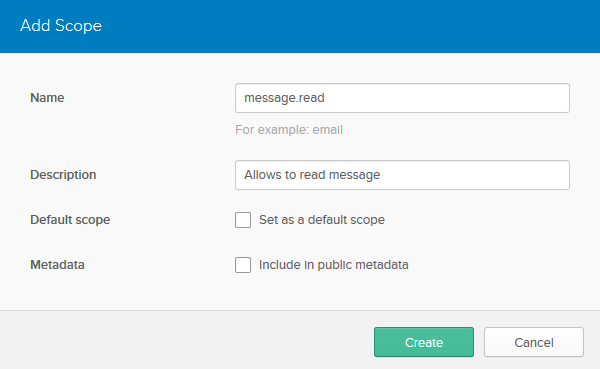

#### Claims

To include custom claims in an _ID token_ or an _access token_, they should be added to our Custom Authorization Server.

Let's add a **Groups** claim to _ID tokens_ and _access tokens_ to perform authentication and authorization using the out Custom Authorization Server.

##### Access Token groups Claim

Click **Claims > Add Claim**. Fill in the fields with these values (leave those not mentioned as their defaults):

| FIELD NAME | VALUE |
| --- | ---|
| **Name** | `groups` |
| **Include in token type** | `Access Token`<br>`Always` |
| **Value type** | `Groups` |
| **Filter** | `Matches regex` `.*` |

Click **Create**.

Created **Claim** will look like:

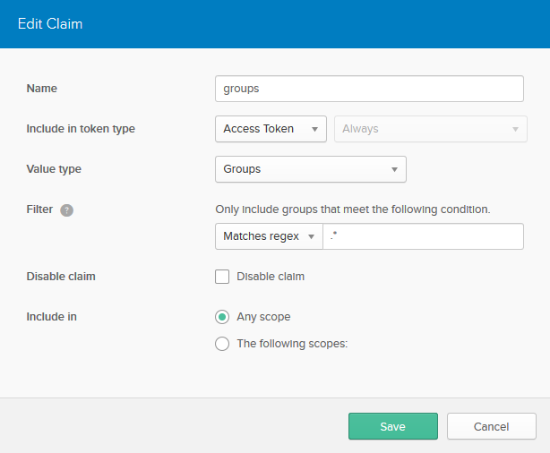

##### ID Token groups Claim

Click **Claims > Add Claim**. Fill in the fields with these values (leave those not mentioned as their defaults):

| FIELD NAME | VALUE |
| --- | ---|
| **Name** | `groups` |
| **Include in token type** | `ID Token`<br>`Always` |
| **Value type** | `Groups` |
| **Filter** | `Matches regex` `.*` |

Click **Create**.

Created **Claim** will look like:

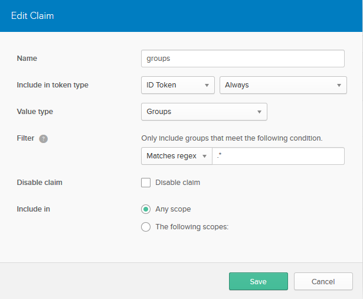

#### Access Policies

Okta **Access Policies** allows to restrict access to application resources.
Each **Access Policy** applies to a particular OpenID Connect application. 
**Access Policies** are containers for rules.
**Rules** define different access depending on the nature of the token request.

##### Access Policy for Hello Okta App

Click the **Access Policies** tab. Click **Add Policy**. Fill in the fields with these values:

| FIELD NAME | VALUE |
| --- | ---|
| **Name** | `Hello Okta App` |
| **Description** | `Hello Okta App` |
| **Assign to** | The following clients: `Hello Okta App` |

Click **Create Policy**.

Created **Policy** will look like:

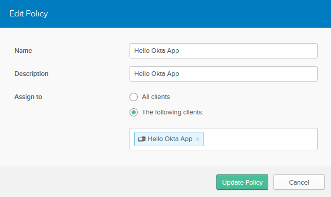

###### Hello Okta App Access Policy Rules

Click **Add Rule**. Fill in the fields with these values:

| FIELD NAME | VALUE |
| --- | ---|
| **Name** | `All users of Hello Okta App has access` |
| **Grant type is** | `Authorization Code` |
| **Scopes requested** | The following scopes: `OIDC default scopes` |

Click **Create Rule**.

Created **Rule** should look like:

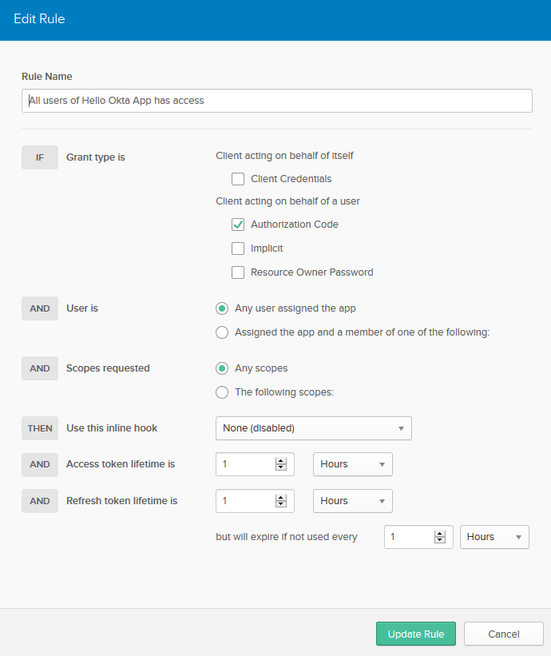

##### Access Policy for Hello Okta Client App

Click the **Access Policies** tab. Click **Add Policy**. Fill in the fields with these values:

| FIELD NAME | VALUE |
| --- | ---|
| **Name** | `Hello Okta App Client` |
| **Description** | `Hello Okta App` |
| **Assign to** | The following clients: `Hello Okta App Client` |

Click **Create Policy**.

Created **Policy** will look like:

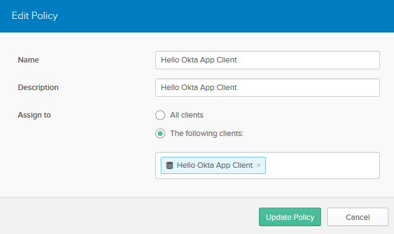

###### Hello Okta App Client Access Policy Rules

Click **Add Rule**. Fill in the fields with these values:

| FIELD NAME | VALUE |
| --- | ---|
| **Name** | `Message read` |
| **Grant type is** | `Client Credentials` |
| **Scopes requested** | The following scopes: `message.read` |

Click **Create Rule**.

Created **Rule** should look like:

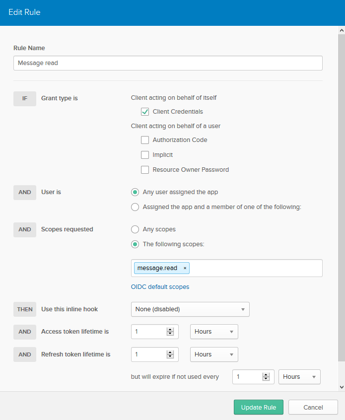

### Set Up Okta Group

#### Add HelloOkta_StandardUser Group
Navigate to **Users > Groups**. Click **Add Group**. Fill in the values:

| FIELD NAME | VALUE |
| --- | ---|
| **Name** | `HelloOkta_StandardUser` |
| **Group Description** | `HELLOOKTA Standard User` |

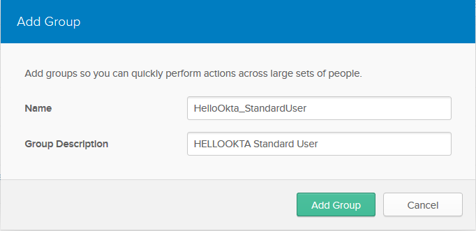

Click **Add Group**.

#### Add User to HelloOkta_StandardUser Group

- Navigate to **Users > Groups**.
- Click on the **HelloOkta_StandardUser** group. 
- Click on the **Manage People** button. 
- Use the search box to find your user and add yourself to the group.
- Click **Save** button

#### Add Trusted Origins

- Navigate to **API > Trusted Origins**.
- Add the following 2 Origins with both `CORS` and `Redirect`:
    - http://localhost:3000
    - https://kubernetes.docker.internal

## Docker

To [build](https://docs.docker.com/compose/reference/build/) API and BFF images:
```
docker-compose build api
docker-compose build bff
```
**Note**, `app.jar` should be built first from the parent directory using the following command:
```
gradlew clean build
```
To [bring up](https://docs.docker.com/compose/reference/up/) API and BFF services:
```
docker-compose up api -d
docker-compose up bff -d
```
To bring up all the services:
```
docker-compose up -d
```

See [README.md](./helm/README.md) to deploy application to Kubernetes Cluster (Docker Desktop)