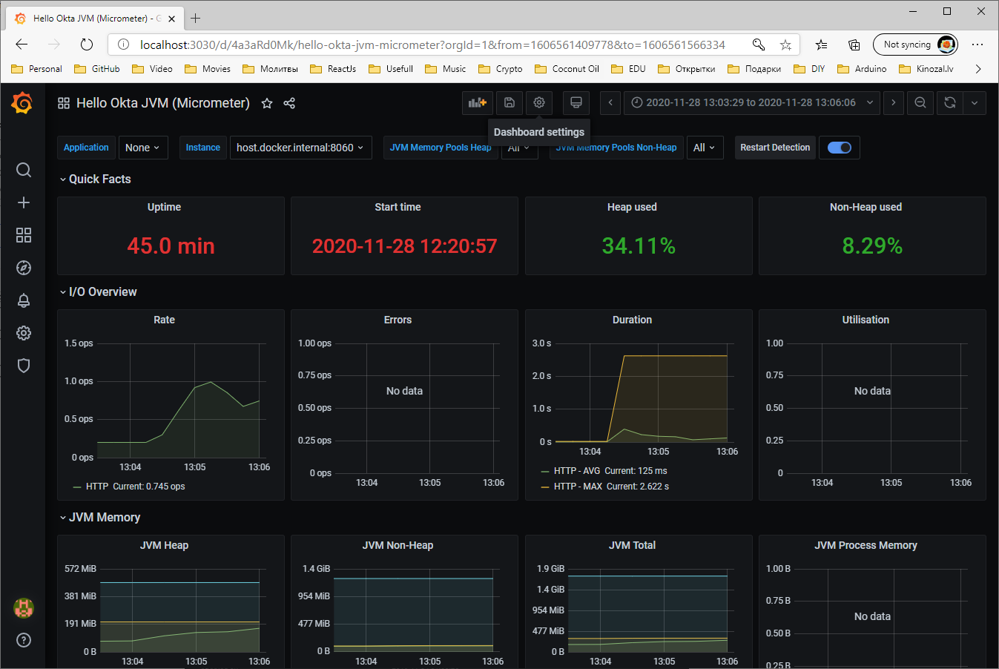

# [Spring Boot Actuator: Production-ready Features](https://docs.spring.io/spring-boot/docs/current/reference/html/production-ready-features.html)

## Endpoints

The following endpoint enabled in this module by default:

- `info`
- `health`
- `metrics`
- `auditevents`
- `httptrace`
- `prometheus`

| ID | Description |
| --- | --- |
| [info](http://localhost:8070/actuator/info) | Displays arbitrary application information. |
| [health](http://localhost:8070/actuator/health) | Shows application health information. |
| [metrics](http://localhost:8070/actuator/metrics) | Shows 'metrics' information for the current application. |
| [auditevents](http://localhost:8070/actuator/auditevents) | Exposes audit events information for the current application. Requires an `AuditEventRepository` bean. |
| [httptrace](http://localhost:8070/actuator/httptrace) | Displays HTTP trace information (by default, the last 100 HTTP request-response exchanges). Requires an `HttpTraceRepository` bean. |
| [prometheus](http://localhost:8070/actuator/prometheus) | Exposes metrics in a format that can be scraped by a Prometheus server. Requires a dependency on `micrometer-registry-prometheus`. |

## Application Information

- Auto-configured `InfoContributors`.
- Custom Application Information:
    - `info.*` Spring [application properties](./src/main/resources/application-actuator.yml).
    - Custom written `InfoContributor`-s.
    
## Prometheus

[Prometheus](https://prometheus.io/) is an open-source system monitoring and alerting toolkit.

After all the services are up and running, it should be accessible in browser via address http://localhost:9090/targets

## Graphana

[Grafana](https://grafana.com/) is an open-source visualisation software that allows administrators to gain insight and to make sense of the gathered data using beautiful charts and graphs.

After all the services are up and running, it should be accessible in browser via address http://localhost:3030

### Configure Grafana

#### Grafana Data Source

Once logged-in, select **Configuration > Data Sources** to add Prometheus as one of the data sources.

Click **Add data source**, search for `Prometheus` and select it.

Fill in the fields with these values (leave those not mentioned as their defaults):

| FIELD NAME | VALUE |
| --- | ---|
| **URL** | `http://host.docker.internal:9090` |

Click on the **Save & Test** button at the bottom of the form. 
If the **Prometheus Data source** testing is successful, you will see a message saying `Data source is working`.

#### Grafana Import Dashboard

Select **Create > Import** to load **JVM (Micrometer)** a dashboard into the Grafana.
New page will be loaded. Enter `4701` into **Import via grafana.com** and click on the *Load* button next to it.

**Note**, correct Prometheus data source should be selected at the **Prometheus** drop-down list. 

Click **Import** button. A dashboard page to be shown:

