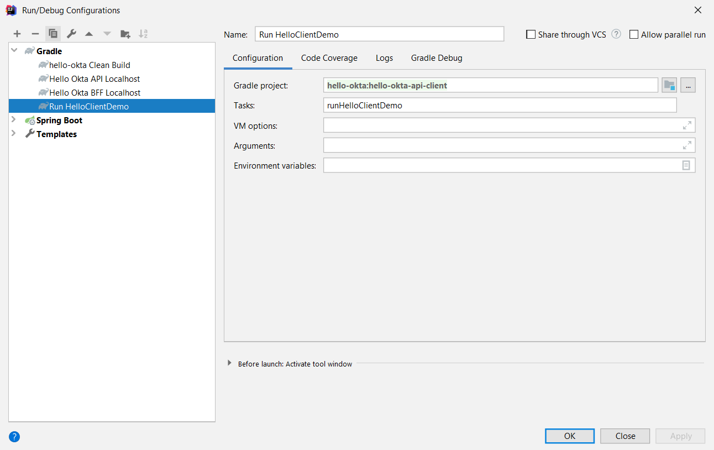

# [REST API Server](../hello-okta-api/README.md) Server Client

Client demonstrates Server-to-Server _Client Credentials_ integration flow which consists of 2 steps:

- Get `access_token` from authorization server
- Call protected resource using this token

## Running Demo Locally

### IntelliJ Gradle Run Configuration

Main class `lv.gennadyyonov.hellookta.api.client.HelloClientDemo` in main sources.
In order to run it the following properties should be checked and adjusted:

- **Proxy Settings**
- **Okta Client Application Properties**

### Proxy Settings

- Proxy Settings can be chnged in [`gradle.properties`](../gradle.properties) file. 
- IdP server should not fall into `nonProxyHosts`
- Application server should fall into `nonProxyHosts`.
- If no proxy exists leave these properties as is, i.e. empty. 

### Okta Client Application Properties

Okta related settings are located in [`demo.properties`](src/main/resources/demo.properties).
