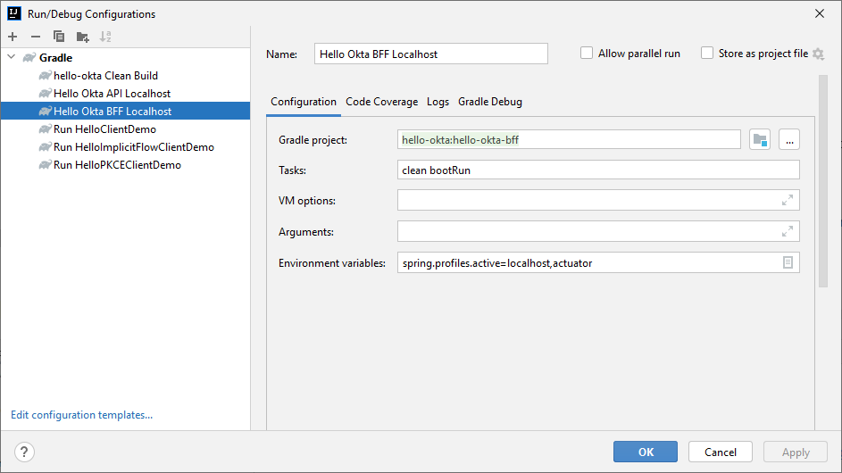
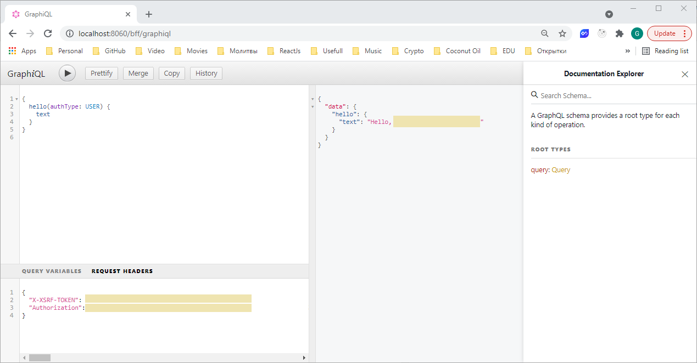

# BFF (Backend for Frontend) Server Application

## Run Application on localhost

One of the easiest options to run application locally is using IntelliJ Gradle Run Configuration.

### IntelliJ Gradle Run Configuration

This option uses `build.gradle` and sets localhost environment variables.

So, configuration properties can be changed the following way:
- **Corporate Proxy Settings** 
    - [`gradle.properties`](../gradle.properties) file. If no proxy exists leave these properties as is, i.e. empty.
- **Application Properties**
    - _Environment variables_ - mostly Okta related can be changed in [.env.localhost](env/.env.localhost) file.

Application will be running on port `8060` by default.
 
It's API can be accessed via [GraphiQL](http://localhost:8060/graphiql) in your browser.

If you see Okta hosted sign-in page then things are working!

You can login with the same account that you created when signing up for your Developer Org, or you can use a known username and password from your Okta Directory.

