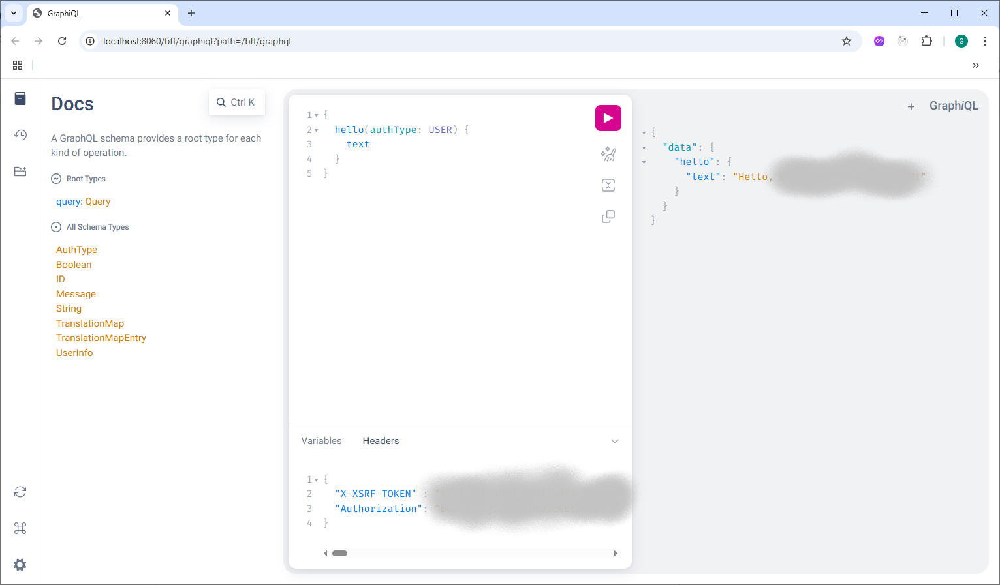

# BFF (Backend for Frontend) Server Application

## Run Application on localhost

One of the easiest options to run application locally is using IntelliJ Gradle Run Configuration.

### IntelliJ Gradle Run Configuration

This option uses `build.gradle`.

So, configuration properties can be changed the following way:
- **Corporate Proxy Settings** 
    - [`gradle.properties`](../gradle.properties) file. If no proxy exists leave these properties as is, i.e. empty.
- **Application Properties**
  - _Environment variables_ - `spring.profiles.active=localhost,actuator`.
  - _Localhost Spring Profile Configuration_
    - Copy [`secrets.yml.sample`](src/main/resources/secrets.yml.sample) to `secrets.yml` under `src/main/resources`
    - Fill in your configuration properties instead of `???`

Application will be running on port `8060` by default.

It's API can be accessed via the following links in your browser:
- [GraphiQL](http://localhost:8060/bff/graphiql)

**Bearer token** should be copied either from browser Network tab or Swagger `curl` and pasted in `REQUEST HEADER` tab.

- [Voyager](http://localhost:8060/bff/voyager)

